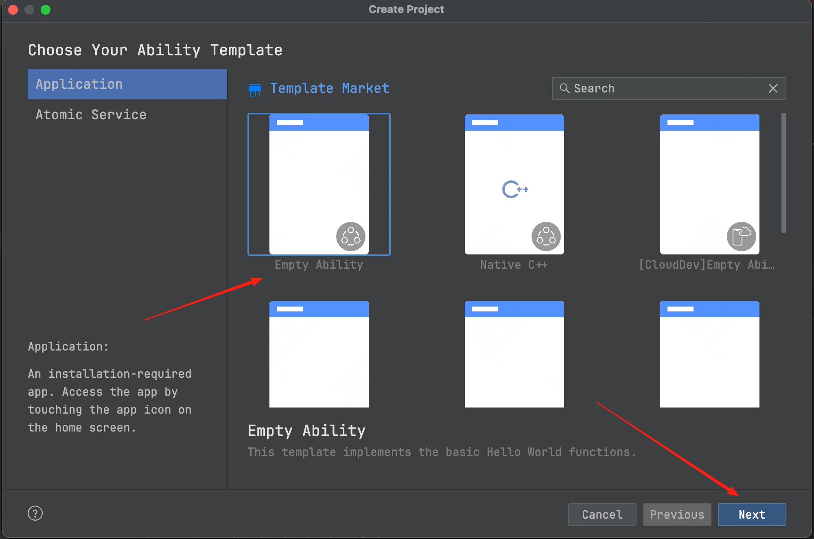

# OpenHarmonyAbility and winit for Harmony

Before the 2025's chinese new year, i need to tell you an amazing thing that we can use winit to develop OpenHarmony application. After about 4 months of development, i have finally finished the first preview version.This blog will introduce the development process and some details of the implementation. Let't get started!

## 1. Introduction

If you're familiar with `Node.js` or `libuv`, you should be aware of the `EventLoop`, as the high performance of both node and libuv is based on this implementation.The overall implementation of OpenHarmony is also like this, so we will involve a lot of asynchronous and callbacks.

The entrance of OpenHarmony must currently be based on the implementation of `ArkTS`, so we cannot use the C ABI to implement the whole logic like Android or iOS. We need a wrapped ArkTS implementation to load native modules and trigger the lifecycle required by native modules. This part of the logic needs to be implemented based on `N-API`, so we provide two packages to handle and simplify this process.

Now i've already finished the first preview version of these crates or packages and also finished the adaption of the winit crate. Then i'll introduce the usage of the crates and packages in detail.

## 2. Usage

1. You need to create a OpenHarmony or HarmonyNext project first.  
   

2. Install the wrapper package for OpenHarmony ability.
   ```bash
   cd your-project/entry
   ohpm install @ohos-rs/ohos-ability
   ```
3. Change the `entry/src/main/ets/entryability/EntryAbility.ets` to the following code:

   ```ts
   import { RustAbility } from "@ohos-rs/ability";
   import Want from "@ohos.app.ability.Want";
   import { AbilityConstant } from "@kit.AbilityKit";

   export default class EntryAbility extends RustAbility {
     public moduleName: string = "example";

     async onCreate(
       want: Want,
       launchParam: AbilityConstant.LaunchParam
     ): Promise<void> {
       super.onCreate(want, launchParam);
     }
   }
   ```

   There are some important parts to note here:
   - You need to extend ` class to use the wrapper package.
   - You need to set the `moduleName` property to the name of your native module.
   - You need to call the `super` class's method for every lifecycle method.

4. We can use `glutin-winit` to create a example with winit.  
   Now you can clone the [glutin](https://github.com/richerfu/glutin) which is forked by myself.

   ```bash
   git clone https://github.com/richerfu/glutin.git
   ```

5. Build the glutin-winit example.

   ```bash
   cd glutin-example
   ohrs build --arch aarch -- -p glutin_examples --example ohos
   ```

6. Copy the dynamic lib to the project.

   ```bash
   cp glutin-example/dist/arm64-v8a/libohos.so your_project/entry/lib/arm64-v8a/libohos.so
   ```

7. Change the `moduleName` to native module name.

8. Run the project.

9. You can see the rendering result in your dervice.  
   

## 3. More

Next, we will continue to use some examples to improve our adaptation level, such as rust-skia, etc. I also hope that you can provide your usage feedback and PR is welcome!
