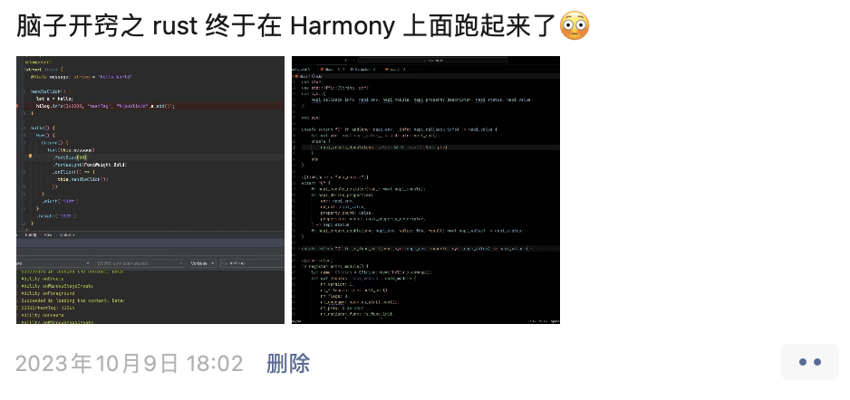

# 🎉 Release 1.0.0

## 起

从 2023 年 9 月份我正式开始接触了原生鸿蒙应用开发，在我读完一遍开发者文档之后，我意识到它可能与 Node.js 是类似的架构，随即我便想到了尝试使用 Rust 开发其 native 模块。

### 开始

2023 年 10 月 9 号 我完成了原型的能力验证，在鸿蒙系统上正式跑起来了 Rust 编译的代码。

### 适配

2023 年 11 月 7 号 我决定基于 [napi-rs](https://napi.rs/) 适配到鸿蒙系统用于 native 模块的开发，9 号就完成了第一个版本的开发，我将其命名为 `ohos-rs`。

此时的系统还是 API9 阶段，相当多的 N-API 处于不支持的状态，于是我便向系统侧提出了要求对其完整 N-API 接口的诉求，这部分接口在此之后逐渐放开。

## 转

从那之后，我逐渐适配了从脚手架到开发、构建、打包、CI/CD等一系列能力和工具，并且开始在各大平台尝试推广，随着 2024 年鸿蒙原生应用适配的全面启动，社区开始逐渐有一些公司和个人开发者采用适配的的`ohos-rs`，在这过程中遇到了一些问题：

1. 跟 Node.js 的表现不一致  
   我开始尝试实现一些适配，并且力求与其表现一致。

2. Rust 生态库打包失败  
   我从最常用的一些库开始适配，提交支持鸿蒙构建以及使用的 PR 以确保可用性，同时我提供了许多对应库的使用示例展示给开发者以避免其可能会遇到的问题。

3. 文档和示例不全  
   慢慢建立起了文档站以及相关的示例工程。

## 承

在 2024 年 10 月 8 号，HarmonyNext 开始了正式的公测，其 API 已经发展到了 API12，相关的能力也基本上已经满足。经过一些应用和 SDK 的验证，`ohos-rs` 的整体能力也逐渐稳定，于是我们决定在今天发布正式的 `1.0.0` 版本。

该版本已经被多个上架应用以及多个社区 SDK 使用，同时我们迁移了 napi-rs 的大量用例基本上都已经通过，这就意味着其代码的稳定性和可用性。

- 能力基本对齐 napi-rs
- 通过了 napi-rs 的大量测试用例
- 补充了部分鸿蒙的拓展能力

我们强烈建议你将脚手架以及对应的 crate 包都升级到正式的 `1.0.0` 以获取到最新和最稳定的能力。

## 合

在此之后，我们将使用 API12 作为适配基线，后续所有新版本的能力以及系统 binding 将与 napi-rs 的适配方式保持类似，通过`feature`的方式提供，并且持续更新相关的文档示例以及工具链。

最后，希望我们的工作对你的工作有所帮助 ～
