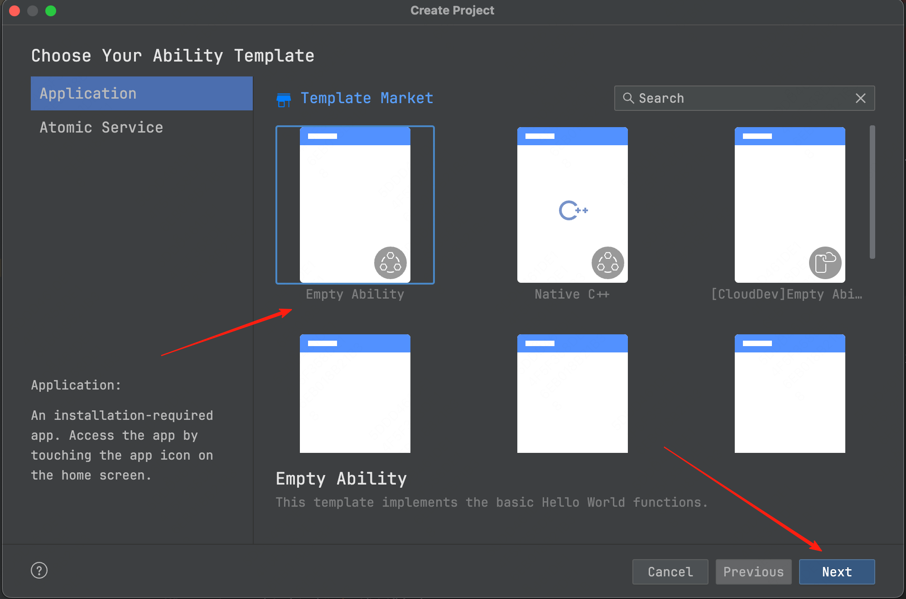
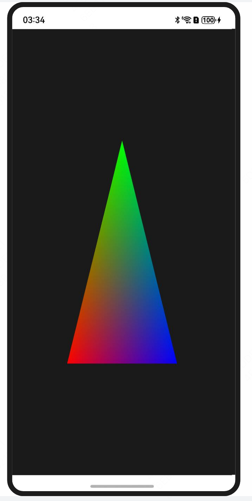

# OpenHarmonyAbility and winit for Harmony

Before the 2025 Chinese New Year, I want to share something important: winit can now be used to develop OpenHarmony applications. After about four months of development, the first preview version is ready. This blog introduces the development process and implementation details.

## 1. Introduction

If you are familiar with `Node.js` or `libuv`, you already know the `EventLoop`; their high performance relies heavily on it. OpenHarmony follows a similar model, so native application development involves many asynchronous calls and callbacks.

The entry point of an OpenHarmony application currently has to be implemented with `ArkTS`, so we cannot implement the whole lifecycle through a C ABI like Android or iOS. We need a wrapped ArkTS entry to load native modules and trigger the lifecycle required by native modules. This layer is implemented with `N-API`, and we provide two packages to simplify the process.

The first preview versions of these crates and packages are now available, and the winit adaptation is also complete. The following sections show how to use them.

## 2. Usage

1. Create an OpenHarmony or HarmonyNext project first.

   

2. Install the wrapper package for OpenHarmony ability.

   ```bash
   cd your-project/entry
   ohpm install @ohos-rs/ohos-ability
   ```

3. Change `entry/src/main/ets/entryability/EntryAbility.ets` to the following code:

   ```ts
   import { RustAbility } from "@ohos-rs/ability";
   import Want from "@ohos.app.ability.Want";
   import { AbilityConstant } from "@kit.AbilityKit";

   export default class EntryAbility extends RustAbility {
     public moduleName: string = "example";

     async onCreate(
       want: Want,
       launchParam: AbilityConstant.LaunchParam
     ): Promise<void> {
       super.onCreate(want, launchParam);
     }
   }
   ```

   Important details:
   - Extend `RustAbility` to use the wrapper package.
   - Set the `moduleName` property to the native module name.
   - Call the superclass method in every lifecycle method.

4. Use `glutin-winit` to create a winit example. Clone the forked [glutin](https://github.com/richerfu/glutin) repository:

   ```bash
   git clone https://github.com/richerfu/glutin.git
   ```

5. Build the glutin-winit example.

   ```bash
   cd glutin-example
   ohrs build --arch aarch -- -p glutin_examples --example ohos
   ```

6. Copy the dynamic library to the project.

   ```bash
   cp glutin-example/dist/arm64-v8a/libohos.so your_project/entry/lib/arm64-v8a/libohos.so
   ```

7. Change `moduleName` to the native module name.

8. Run the project.

9. You should see the rendering result on the device.

   

## 3. More

Next, we will continue improving the adaptation through more examples, such as rust-skia. Feedback and PRs are welcome.
