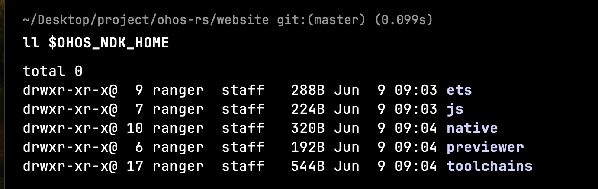

# 快速开始

我们基于 Rust 实现了一个简单的脚手架工具，提供了类似于初始化，构建等命令。

我们现在开始一步步介绍如何基于 ohos-rs 开发一个鸿蒙原生模块。

## 环境准备

在开始之前，我们需要安装 `Rust` 和 `HarmonyOS NDK`.

### Rust

对于 Rust 来说，我们可以直接使用官方提供的安装脚本来实现安装。

```shell
curl --proto '=https' --tlsv1.2 -sSf https://sh.rustup.rs | sh
```

::: tip 🌈
1. 你需要确保你安装的 Rust 版本是 >= 1.78.0 的
2. 更多关于 Rust 的信息和知识点，你可以访问 [link](https://www.rust-lang.org/learn/get-started)
:::

然后我们需要安装一些 Rust 的 toolchain 来帮助我们构建鸿蒙的原生模块。

```shell
rustup target add aarch64-unknown-linux-ohos
rustup target add armv7-unknown-linux-ohos
rustup target add x86_64-unknown-linux-ohos
```
   
### HarmonyOS NDK

::: tip
对于最新的 ohos-rs 版本，鸿蒙 NDK 的版本需要是 `DevEco Studio NEXT Developer Beta1 (5.0.3.100)` 或者更新.
:::

你只需要下载最新的 `DevEco-Studio` 然后安装对应的 NDK 即可. 你可以在 [官方网站](https://developer.huawei.com/consumer/cn/deveco-studio/) 找到并且下载。

下载完成之后，你需要为系统设置一个环境变量来帮助我们构建原生模块。假设你安装的 SDK 路径为 `/path/Sdk`，那么我们只需要设置如下的环境变量即可：

```shell
# 一般来说 SDK 目录下面都有多个版本，选择你自己需要使用的版本即可。
# 对于 unix 系统的用户来说请务必使用 export 否则会导致读取不到环境变量
export OHOS_NDK_HOME=/path/Sdk/9/

# 对于 5.0.0 release 的 IDE 来说他的路径示例如下所示：
export OHOS_NDK_HOME=/Applications/DevEco-Studio.app/Contents/sdk/default/openharmony
```

设置完成之后，我们可以尝试查看环境变量的内容，效果如下所示：



## 安装

现在你可以用 `cargo` 来安装脚手架工具了。

```shell
cargo install ohrs
```

## 简单的项目示例

使用 `ohrs` 来初始化项目。

```shell
ohrs init hello
```

之后使用 `ohrs` 来构建项目

```shell
ohrs build
```

## IDE 提示

对于升级到 `1.0.0` 版本的项目来说，可能会遇到某些能力或者 API 不支持的情况。这是因为 `rust-analyzer` 在默认情况下使用本机的 target 作为默认的构建 target。为了避免出现这种问题，我们可以修改 rust-analyzer 的默认构建产物为鸿蒙的产物，以 VS Code 为例其配置如下所示：

```json
// .vscode/settings.json
{
    "rust-analyzer.cargo.target": "aarch64-unknown-linux-ohos"
}
```
