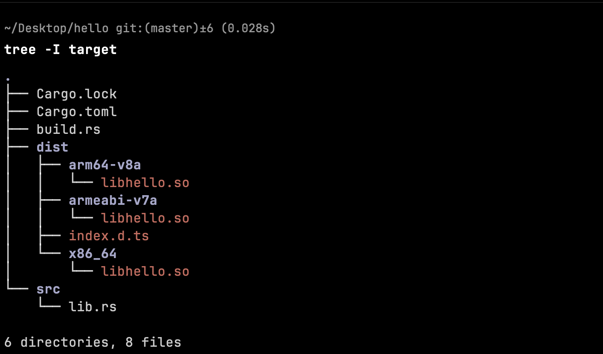

# 一个简单的项目🌰

我们可以使用脚手架工具来初始化我们的鸿蒙 native 模块项目，当然也可以通过 Rust 标准的项目来创建鸿蒙的 Native 模块。

现在我们尝试使用一个标准的 Rust 项目来开发鸿蒙 native 模块。

## 初始化

使用 `cargo` 工具来初始化一个 `lib` 类型的包

```shell
cargo new hello --lib
```

## 添加依赖

我们需要添加一些依赖，这些依赖将会为我们提供很多有用的能力来让我们能够快速的创建鸿蒙 native 模块。

```shell
cargo add napi-ohos napi-derive-ohos

cargo add napi-build-ohos --build
```

## 设置包构建产物

Rust 的标准项目中支持了非常多的构建产物类型。对于鸿蒙 native 模块来说，我们只需要使用`cdylib`的类型即可。现在我们将`Cargo.toml`文件新增如下内容。

```toml
# Cargo.toml

[lib]
crate-type=["cdylib"]
```

## 初始化构建脚本

`build.rs` 是 cargo 管理的 Rust 项目中的一个特殊文件，它将会在项目的真实构建之前被执行。我们可以使用这个文件来实现一些逻辑以满足我们的构建需求和场景。

::: tip 🔆
想要了解更多关于 `build.rs` 的信息，你可以在 [官方文档](https://doc.rust-lang.org/cargo/reference/build-scripts.html) 中查看。
:::

首先，创建一个名为`build.rs`的文件，文件路径位于项目的根目录。然后我们在该文件中新增如下内容：

```rust
// build.rs
fn main () {
    napi_build_ohos::setup();
}
```

现在我们的项目整体结构看起来应该如下所示：

```txt
.
├── Cargo.lock
├── Cargo.toml
├── build.rs
└── src
    └── lib.rs
```

## 实现 native 方法

现在我们可以来实现一些 native 方法了。比如我们现在实现一个用于计算两数只和的方法，其代码则如下所示：

```rust
use napi_derive_ohos::napi;

#[napi]
pub fn add(a: u32,b: u32) -> u32 {
    a + b
}
```

## 构建

只需要通过`ohrs`一个命令就可以完成构建了。、

```shell
ohrs build
```

然后我们可以看到项目根目录出现了`dist`文件夹，其中包含了各个目标架构下的最终产物以及类型声明文件`index.d.ts`。


